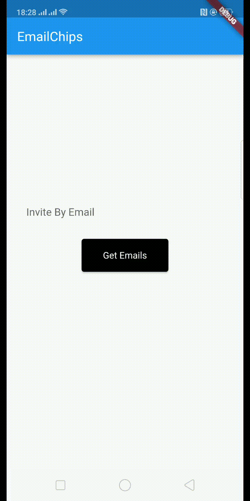

<!-- 
This README describes the package. If you publish this package to pub.dev,
this README's contents appear on the landing page for your package.

For information about how to write a good package README, see the guide for
[writing package pages](https://dart.dev/guides/libraries/writing-package-pages). 

For general information about developing packages, see the Dart guide for
[creating packages](https://dart.dev/guides/libraries/create-library-packages)
and the Flutter guide for
[developing packages and plugins](https://flutter.dev/developing-packages). 
-->

Flutter package chipemails provides you to building inputChips and show these chips as an output 

## Features



## Getting started

In your flutter project, add the dependency to your pubspec.yaml

```dart
dependencies:
  ...
  chip_emails:
```
## Usage

All you need is simple import library for this flutter package

```dart
import 'import 'package:chip_emails/chip_emails.dart;
```

```dart
 EmailChips(
              press: () {

              },
              emails: email_list,
              backgroundcolor: Colors.blue,
              editingController: emailcontroller,
            ),
```

